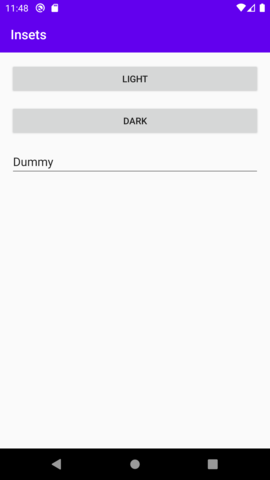
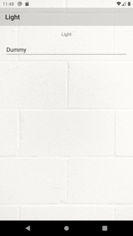
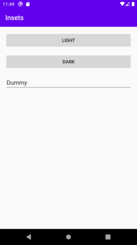
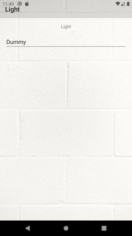
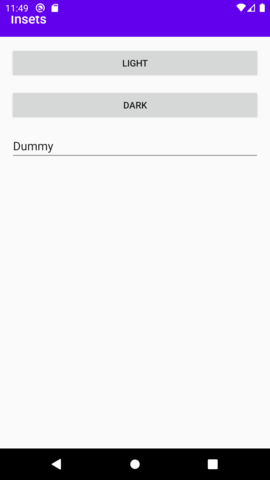

# MotionLayout with FragmentContainerView and Insetter

Sample app that demonstrates weird (buggy?) behavior when combining MotionLayout, FragmentContainerView and [Insetter](https://github.com/chrisbanes/insetter).

This app has 2 launcher icons: "Insets ConstraintLayout" and "Insets MotionLayout".
The only difference between the 2 activities is that the former wraps the FragmentContainerView inside a ConstraintLayout, the latter inside a MotionLayout.

## "Insets ConstraintLayout" works as expected

  

1. Start "Insets ConstraintLayout"
1. Notice that the toolbar on the menu screen has insets. It does not overlap with the status bar.
1. Click on the "Light" button.
1. Notice that the toolbar on the light screen has insets. It does not overlap with the status bar.
1. Press back
1. Notice that the toolbar on the menu screen has insets. It does not overlap with the status bar.

Conclusion: everything works as expected

## "Insets MotionLayout" does not work as expected

  

1. Start "Insets MotionLayout"
1. Notice that the toolbar on the menu screen has insets. It does not overlap with the status bar.
1. Click on the "Light" button.
1. Notice that the toolbar on the light screen DOES NOT HAVE INSETS. It overlaps with the status bar.
1. Press back
1. Notice that the toolbar on the menu screen DOES NOT HAVE INSETS. It overlaps with the status bar.

Conclusion: only the first screen gets insets. Any other screen is missing insets.

Note: Whenever a screen did not get any insets, you can click in the EditText and it will 'fix' the insets. ¯\\_(ツ)_/¯
